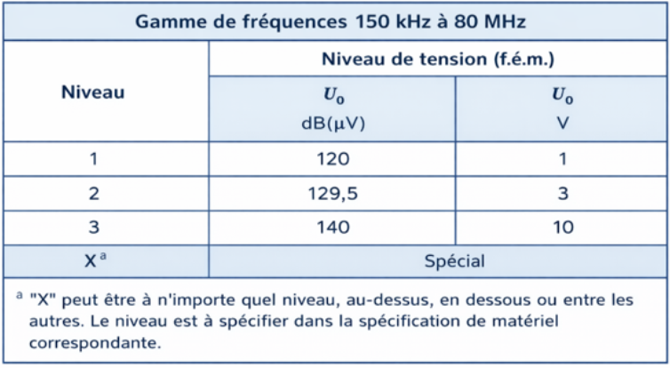
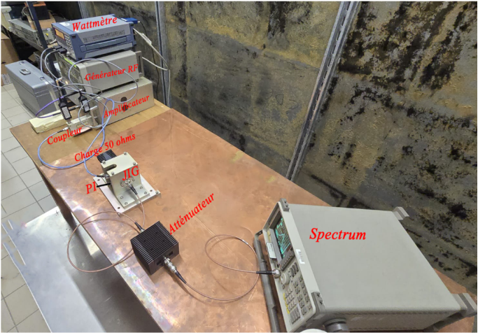

# 1. Introduction

&nbsp;&nbsp;&nbsp;&nbsp; Dans l’environnement industriel moderne, les équipements électroniques sont exposés à un niveau croissant de perturbations électromagnétiques. Cette pollution électromagnétique est particulièrement signifcative dans des environnements complexes tels que l’automobile et l’aéronautique, où coexistent de multiples sources d’émissions (convertisseurs de puissance, systèmes de communication, moteurs électriques, calculateurs embarqués, etc.). Ces perturbations peuvent altérer le fonctionnement normal des dispositifs électroniques et compromettre leur fabilité. La capacité d’un équipement à fonctionner correctement en présence de telles perturbations est définie comme son immunité électromagnétique. Parmi les phénomènes de perturbation les plus critiques figurent les perturbations conduites et rayonnées. Les perturbations conduites se propagent principalement à travers les câbles d’alimentation ou de communication, tandis que les perturbations rayonnées se transmettent par couplage électromagnétique dans l’espace environnant. Dans le domaine automobile notamment, les faisceaux de câblage constituent des chemins privilégiés pour la propagation des interférences, pouvant ainsi affecter les calculateurs électroniques et les systèmes embarqués. Afin d’évaluer l’immunité des équipements face à ces phénomènes, des essais normalisés sont réalisés en laboratoire. Ces tests consistent à reproduire des conditions représentatives de l’environnement réel en injectant des perturbations contrôlées sur les câbles de l’équipement sous test (EST). Parmi ces essais, le test BCI (Bulk Current Injection) constitue une méthode largement utilisée pour l’évaluation de l’immunité conduite surtout en environnement automobile. Le principe de base de la méthode BCI repose sur l’injection d’un courant perturbateur haute fréquence dans les faisceaux de câbles via une pince d’injection, sans contact galvanique direct. Les essais sont réalisés conformément aux exigences normatives en vigueur dans chacun des domaines spécifque. Dans le cadre de ce projet, nous avons adopté une démarche méthodologique complète pour réaliser un processus de calibrage et de test d’une méthode BCI. Dans un premiers temps, nous défnissons les principaux équipements utilisés ainsi leurs qualifcation vis-à-vis les transparences électromagnétique à partir des études analytiques notamment les fonctions de transfert afn d’anticiper leur comportement face aux perturbations injectées. Ensuite la phase de calibrage de ces équipements nous serait indispensable, pour cela on commence par calibrer l’analyseur de réseau vectoriel (VNA),afin de passer au calibrage et la caractérisation des autres équipements. Une fois les données de ces caractéristiques sont relevées soigneusement, on procède à renseigner ces facteurs dans le logiciel de pilotage qui va nous assurer le bon calibrage de setup complet. Principalement, et conformément à la norme EN 61000-4-6 nous réalisons des essais selon trois niveaux de sévérité : 1V, 3V et 10V. Nous avons également la chance de réaliser deux essais d’immunité conduite avec le réseau de couplage et de découplage (CDN). Où on va pouvoir mener des études comparatives avec la pince d’injection.

# 2. Description du test BCI

&nbsp;&nbsp;&nbsp;&nbsp; Le test BCI est un essai d’immunité conduite utilisé en Compatibilité Électromagnétique (CEM) afin d’évaluer la robustesse d’un équipement électronique face aux perturbations radiofréquences. L’objectif est de reproduire le couplage électromagnétique susceptible d’apparaître entre un champ rayonné et le faisceau de câbles d’un système électronique. En environnement réel, les câbles peuvent se comporter comme des antennes réceptrices et conduire des courants perturbateurs vers l’équipement. Le test BCI permet de reproduire ce phénomène de manière contrôlée en injectant directement un courant RF dans le faisceau de câbles, afn d’analyser le comportement du système soumis à une contrainte représentative de son environnement électromagnétique.

## 2. 1. Principe de fonctionnement

&nbsp;&nbsp;&nbsp;&nbsp; Le principe du test consiste à injecter un courant haute fréquence dans le faisceau de câbles à l’aide d’une pince d’injection positionnée autour du câble. Cette pince fonctionne selon le principe d’un transformateur : l’enroulement interne alimenté par un générateur RF constitue le primaire, tandis que le câble traversant la pince joue le rôle de secondaire. Le couplage entre la pince et le câble est principalement inductif, tandis que le blindage de la pince permet de limiter le couplage capacitif. Le signal RF est d’abord généré puis amplifé avant d’être appliqué à la pince d’injection. On induit ainsi un courant de mode commun dans le faisceau de câbles. Ce courant se propage le long des conducteurs et peut perturber les circuits internes via les interfaces d’entrée et de sortie. L’essai permet donc d’observer le comportement du système face à une sollicitation électromagnétique conduite.

***Figure 1: Principe du test BCI***

## 2. 2. Procédure de test

&nbsp;&nbsp;&nbsp;&nbsp; Le test BCI se déroule généralement en deux étapes principales : la calibration puis l’injection. Dans un premier temps, on réalise une phase de calibration afn d’établir la relation entre la puissance appliquée à la pince et le courant réellement injecté. Cette calibration est effectuée sur un montage de référence présentant une impédance connue en mode commun. On obtient ainsi une courbe de calibration sur l’ensemble de la plage fréquentielle considérée. Une fois cette étape validée, on procède à l’injection sur l’équipement sous test. On effectue alors un balayage fréquentiel sur la plage défnie par la norme applicable. À chaque fréquence, on injecte le courant spécifé, on maintient le niveau pendant une durée déterminée, et on surveille le fonctionnement du système. Les éventuelles dégradations sont ensuite classées selon les critères de performance défnis par la norme.

*-* **Boucle ouverte (méthode de substitution)**:

La puissance appliquée à la pince d’injection est déterminée lors de la phase de calibration sur une charge de référence. Pendant l’essai, cette puissance est appliquée sans régulation active du courant. Le courant réellement injecté dépend donc de l’impédance du faisceau de câbles et peut varier en fonction de la fréquence. Cette méthode est simple à mettre en œuvre et rapide, mais elle reste sensible aux variations d’impédance et peut conduire à un sous-test à certaines fréquences d’antirésonance.

*-* **Boucle fermée (méthode asservissement)**:

Le courant injecté est mesuré en permanence à l’aide d’une pince de mesure. On compare ce courant à la valeur de consigne, et le système ajuste automatiquement la puissance du générateur afn de maintenir un courant de mode commun constant. Cette méthode offre une meilleure précision et une meilleure reproductibilité. En revanche, à certaines fréquences, la puissance maximale disponible peut ne pas sufre à atteindre la consigne fxée.

# 3. Recommandations et normes

## 3. 1. Recommandations 

&nbsp;&nbsp;&nbsp;&nbsp; Les essais d’immunité par injection de courant (BCI) s’inscrivent dans le cadre général des normes de Compatibilité Électromagnétique (CEM). Lorsqu’on réalise un test BCI, on s’appuie obligatoirement sur un référentiel normatif qui défnit les conditions de test, les méthodes de mesure, les niveaux de sévérité ainsi que les critères d’acceptation. Le respect de ces normes permet d’assurer la reproductibilité des essais, la comparabilité des résultats entre laboratoires et la conformité réglementaire des équipements. On garantit ainsi que le niveau d’immunité validé correspond réellement à l’environnement d’utilisation du produit. Les exigences varient selon le domaine d’application. En fonction du secteur considéré, on n’a pas la même plage fréquentielle d’essai, ni les mêmes niveaux de courant injecté, ni les mêmes critères de performance. Les normes précisent également la méthode de calibration à utiliser, la confguration du banc d’essai et les modalités de surveillance du fonctionnement pendant le test.

# 3. 2. Normes de test BCI 

La méthode Bulk Current Injection est décrite dans plusieurs normes internationales.

*-* **Domaine automobile**:

La référence principale est la norme ISO 11452-4. Cette norme défnit la méthode d’essai par injection de courant à l’aide d’une pince d’injection. On y retrouve une plage fréquentielle généralement comprise entre 1 MHz et 400 MHz. La norme précise également la procédure de calibration, qui peut être réalisée en boucle ouverte ou en boucle fermée, ainsi que la disposition du faisceau de câbles pendant l’essai. Les dégradations observées sont ensuite classées selon des critères de performance normalisés

*-* **Domaine aéronautique**:

On se réfère principalement à la norme DO-160G, section 20. Elle traite des essais d’immunité aux radiofréquences conduites et rayonnées pour les équipements embarqués. Les niveaux de sévérité sont généralement plus élevés que dans le domaine automobile, car l’environnement électromagnétique est plus contraignant, notamment en présence de radars et de systèmes de communication haute puissance.

*-* **Circuits intégrés**:

On utilise la norme IEC 62132-3, qui adapte la méthode BCI aux composants électroniques de petite dimension. Même si le contexte diffère, on retrouve les mêmes principes fondamentaux : un couplage inductif via une pince, une calibration préalable et une surveillance continue du fonctionnement pendant l’essai.

### 3. 2. 1 La norme EN 61000-4-6

La norme EN 61000-4-6 défnit la méthode d’essai permettant d’évaluer l’immunité des équipements électriques et électroniques aux perturbations conduites induites par des champs radiofréquences. Elle fait partie de la série IEC 61000 relative à la compatibilité électromagnétique (CEM), et plus précisément de la partie 4 consacrée aux techniques d’essai et de mesure. Cette norme s’applique aux équipements comportant au moins un câble conducteur, tel qu’un cordon d’alimentation, une ligne de signal ou une connexion de masse, susceptible de capter des perturbations électromagnétiques. En effet, sous l’effet d’un champ radiofréquence, les câbles peuvent se comporter comme des antennes et véhiculer des courants de mode commun vers l’équipement. L’essai vise donc à simuler ce phénomène de manière contrôlée afn d’évaluer l’immunité fonctionnelle du matériel.

La norme EN 61000-4-6 est utilisée dans de nombreux secteurs où la robustesse électromagnétique est essentielle : domaine industriel, télécommunication et électronique grand public. Elle sert de référence aux normes de produit qui précisent les niveaux d’essai
et les critères de performance applicables à chaque type d’équipement. La plage de fréquences couverte par la norme est comprise entre 150 kHz et 80 MHz. Le signal d’essai est une onde radiofréquence modulée en amplitude à 80 % par une sinusoïde de 1 kHz, afn de reproduire des conditions réalistes d’exposition aux émetteurs radioélectriques. Les niveaux d’essai sont défnis en tension en circuit ouvert (force électromotrice) à l’accès de l’équipement et sont présentés dans le tableau suivant :

***Figure 2: Niveaux d’essai selon EN 61000-4-6***

# 4. Qualification & calibrage des équipements

## 4. 1. Importance de la qualification des équipements

Les tests de compatibilité électromagnétique exigent des équipements de mesure performants et fables. Les pinces d’injection de courant, sondes de monitoring (pince de mesure) et amplificateur constituent la base instrumentale de tout laboratoire CEM professionnel. Tous ces équipements de test doivent être régulièrement étalonnés pour garantir la validité des résultats. Les JIGs de calibrage permettent de vérifier rapidement la courbe d’impédance de transfert des pinces d’injection et des sondes avant chaque campagne d’essai. Cette vérifcation systématique assure la conformité métrologique et facilite l’accréditation des laboratoires. Que l’on utilise la méthode de substitution ou la méthode en boucle fermée, l’étalonnage du système constitue la première étape indispensable du processus de test. Lors de cette phase, les niveaux de test ainsi que les niveaux de puissance correspondants sont enregistrés afn d’être réutilisés ultérieurement pendant les essais. La qualifcation préalable des équipements de test est une étape essentielle. En effet, dans le domaine de la mesure et des essais, les instruments ne sont jamais totalement neutres : ils peuvent influencer les résultats obtenus. L’objectif principal de la qualifcation est donc d’analyser l’équipement de mesure avec un regard critique, en prenant en considération ses différents comportements, ses incertitudes et les grandeurs susceptibles d’impacter les résultats des tests. Dans le cadre des mesures électroniques, et plus particulièrement en compatibilité électromagnétique, la maîtrise et la précision des valeurs mesurées sont primordiales. Une attention particulière doit être portée au respect des seuils imposés par les normes en vigueur, afin d’éviter tout dépassement pouvant invalider les essais. Il convient également de souligner que chaque constructeur a l’obligation de fournir les caractéristiques techniques associées à ses équipements ainsi que les spécifcations relatives à leur utilisation en mesure. Ces informations constituent une base essentielle pour garantir la fabilité et la conformité des résultats obtenus dans le cadre du test. Néanmoins, la procédure de qualifcation reste indispensable, car les caractéristiques d’un équipement peuvent être influencées par de nombreux phénomènes, notamment la dérive et la dégradation progressive des performances au cours du temps. Une vérifcation régulière permet ainsi d’assurer la constance, la précision et la traçabilité des mesures réalisées. Dans le but de réaliser un bon calibrage de setup complet d’un essai BCI et d’assurer le bon fonctionnement des équipements, et afn de renseigner les caractéristiques exacte de ces équipements dans le logiciel de pilotage, il va falloir au préalable de calibrer ces équipements un par un. Pour cela, on défnit l’ensemble d’équipements susceptible à être qualifer comme suit : Pince d’injection (PI), pince de mesure (PM), coupleur directionnel, câbles RF, amplifcateur, en utilisant généralement un analyseur de réseau vectoriel (VNA).

## 4. 2. Le VNA (Vector Network Analyzer):

permet de caractériser les paramètres \(S\) des éléments RF, notamment : $$ S_{11} : \text{réflexion à l'entrée} $$ $$ S_{21} : \text{transmission entre l'entrée et la sortie} $$. Avant de mesurer une pince ou un coupleur, on réalise une calibration du VNA afin de déplacer le plan de référence jusqu'aux connecteurs où sera raccordé le dispositif sous test. Une calibration classique peut utiliser un CalKit :

**S — Short**

**O — Open**

**L — Load**

**T — Throu**

Elle permet notamment de corriger les erreurs systématiques du VNA : pertes, désadaptation et directivité. Dans une chaîne BCI, la calibration est importante pour obtenir une mesure fiable de la perte d'insertion, du couplage et des niveaux RF.

## 4. 3. Pince d'injection BCI

La pince d'injection est essentiellement un transformateur RF qui permet de transférer de l'énergie électromagnétique vers le faisceau de câbles sans connexion électrique directe.

Pour une charge résistive équivalente \(Z\), on a :

$$ P=\frac{V_{\mathrm{rms}}^2}{Z} $$

et :

$$ V_{\mathrm{rms}}=I_{\mathrm{rms}}Z $$

donc :

$$ \boxed{P=I_{\mathrm{rms}}^2Z} $$

Ainsi :

$$ I_{\mathrm{rms}} = \sqrt{\frac{Z}{P}} $$

La pince d'injection possède une caractéristique de transfert qui dépend de la fréquence. On peut définir un facteur de couplage sous une forme générale :

$$ CF(f)=\frac{I_{\mathrm{inj}}}{\sqrt{P_{\mathrm{inc}}}} $$

où :

\(CF\) : facteur de transfert de la pince ;
\(I_{\mathrm{inj}}\) : courant injecté ;
\(P_{\mathrm{inc}}\) : puissance incidente appliquée à la pince.

En dB, on rencontre des expressions du type :

$$
CF_{\mathrm{dB}} = 20\log_{10}\left(\frac{I_{\mathrm{inj}}}{\sqrt{P_{\mathrm{inc}}}}\right)
$$

## 4. 3. Pince de mesure

L’analyseur de réseau alimente une borne du JIG, l’autre borne étant terminée par une charge de 50 Ω. Bien que l’analyseur de réseau fonctionne en termes de puissance, il est plus simple de raisonner en termes de tensions correspondantes, puisqu’il s’agit d’un système de $50 Ω$. L’analyseur de réseau mesure le rapport entre la tension de sortie de la sonde de courant $V$ p et la tension d’alimentation du JIG Vin, soit $(Vp/Vin)$. Si l’analyseur de réseau fonctionne en paramètres $S$, cette mesure correspond alors à mesurer $S21$. La relation entre la tension de sortie de la sonde de courant et le courant circulant dans le $f_l$ conducteur autour duquel la sonde est placée est défnie comme l’impédance de transfert de la sonde, généralement notée $Zt$.

$$
Z_t = \frac{V_p}{I} = \frac{V_p}{V_{\mathrm{in}}} \times 50
$$

## 4. 4. Qualifcation du coupleur directionnel

Dans le cadre d’un test BCI, le coupleur directionnel joue un rôle important dans la boucle de contrôle et de mesure des puissances. Il consiste à surveiller en temps réel la puissance que l’amplifcateur envoie vers la pince. On peut définir les propriétés communes recherchées pour tous les coupleurs directionnels : une large bande passante opérationnelle, une directivité élevée, des pertes d’insertion minimales et une bonne adaptation d’impédance à tous les ports lorsque les autres ports sont terminés par des charges adaptées. Grâce à ce coupleur, on peut distinguer facilement la puissance directe (incidente) qui va de la source vers la charge ainsi que la puissance réfléchie qui revient de la charge vers la source en cas de désadaptation d’impédance.

On va s’intéresser, dans notre étude, aux pertes d’insertion des deux ports (incident et réfléchi), ainsi qu’au facteur de couplage. Ce dernier représente le rapport entre la puissance sur la ligne principale et celle mesurée sur le port couplé (qui fournit un échantillon de la puissance directe). Il peut s’exprimer en dB par la formule suivante :

$$
IL_{(i,2,1)}\,(\mathrm{dB}) = -10\log_{10}\left(\frac{P_ligne}{P_couplé}\right)
$$

## 4. 5. L’importance de la linéarité de l’amplificateur

Lors des essais BCI, il est indispensable de prendre en compte la non-linéarité de l’amplifcateur de puissance utilisé en amont du banc d’essai, car elle peut contribuer de manière signifcative aux incertitudes du signal de perturbation. Cette non-linéarité peut dominer l’incertitude globale des calculs et conduire à des résultats erronés ou à une mauvaise interprétation du niveau réel de perturbation injecté.

*-* La linéarité de l’amplificateur permet de nous assurer principalement que le niveau de tension de perturbation est correct au niveau de la tension de calibrage, ainsi que sur la profondeur de modulation en amplitude (MA).

*-* La saturation de l’amplificateur est particulièrement indésirable lors des essais BCI, car elle génère des harmoniques à la sortie de l’amplifcateur qui contribuent de manière signifcative aux valeurs mesurées lorsque le mesureur de puissance mesure la puissance totale de la composante fondamentale et de ses harmoniques. Dans un cas pareil, on ne sera pas compétent d’identifer l’immunité de notre EUT s’il répond à la fréquence fondamentale ou à ses harmoniques. Elle peut également provoquer la défaillance de l’EUT.

*-* La limitation de tous les harmoniques à la sortie de l’amplifcateur doit être inférieure à 15 dB par rapport à la fondamentale pour qu’il soit considéré comme adapté. Il convient alors de vérifer la linéarité de l’amplifcateur afn de s’assurer que si on augmente la puissance à l’entrée, la sortie augmente proportionnellement.

# 5. Mise en place du setup

## 5. 1. Logiciel de pilotage

Le pilotage du banc d’essai BCI est assuré par le logiciel emcware® v4.0 développé par AR RF/Microwave Instrumentation. On utilise ce logiciel pour automatiser les essais de compatibilité électromagnétique, que ce soit en immunité rayonnée ou en immunité conduite. Dans le cadre des essais BCI, on a un contrôle automatique du générateur RF, de l’amplifcateur de puissance et du coupleur directionnel. Le logiciel permet également d’acquérir les mesures issues de la pince de courant, d’exécuter le balayage fréquentiel et d’enregistrer l’ensemble des résultats. En mode boucle fermée, on bénéfcie d’un asservissement automatique du courant injecté. Le logiciel compare en permanence le courant mesuré à la consigne défnie et ajuste la puissance du générateur afn de maintenir un niveau constant malgré les variations d’impédance du faisceau. Grâce à cette automatisation, on améliore la reproductibilité des essais, on réduit les erreurs de manipulation et on assure une meilleure traçabilité des campagnes de test.

## 5. 2. Confguration et montage de setup

Dans cette étape, nous allons décrire la mise en place du setup complet pour le lancement de la phase de calibrage. Nous nous intéresserons, dans un premier temps, au calibrage par la méthode de substitution, en utilisant des équipements déjà calibrés. Cette phase de calibrage permet de relever la puissance nécessaire pour atteindre le niveau de sévérité de test requis sur toute la plage de fréquences, conformément à la norme EN 61000-4-6. Comme indiqué dans la section précédente, trois niveaux de tension sont considérés : 1 V, 3 V et 10 V. Pour chacun de ces niveaux, une procédure de calibration, suivie d’une phase de vérifcation, sera effectuée. Après chaque calibration, les données enregistrées par le logiciel pourront être extraites sous forme de rapports, disponibles dans différents formats (principalement en .docx et .csv).

## 5. 3. Confguration du logiciel EMCware

Avant de lancer toute calibration, il est nécessaire de confgurer au préalable le logiciel de pilotage. Cette étape consiste à spécifer la norme sur laquelle on va travailler, à renseigner les facteurs de correction issus du calibrage des équipements, ainsi qu’à compléter, si nécessaire, les informations relatives au client. Dans un premier temps, après avoir sélectionné la norme de travail, on renseigne les paramètres de test. Cela inclut notamment le niveau de sévérité du test, la puissance de démarrage, les tolérances de calcul ainsi que le pas de fréquence pour le balayage. On rappelle que, lors des essais (pour les deux méthodes), un signal modulé en amplitude (AM) est utilisé. La fréquence porteuse fc varie dans la bande de fréquences dédiée. La modulation AM utilisée dans les tests d’immunité conduite est généralement de 1 kHz avec un taux de modulation de 80 %, contrôlé par un facteur m tel que 0 < m < 1. La modulation maximale est obtenue pour m = 0,8. Par ailleurs, lors de la phase de calibrage, la puissance du signal non modulé est augmentée de 5,1 dB afn de représenter correctement l’amplitude du signal modulé utilisé pendant les essais. La deuxième étape concerne le routage du signal. Dans cette section, on défnit les équipements de test constituant la chaîne de transmission du signal RF, depuis sa génération jusqu’à l’analyseur de spectre. Troisièmement, une rubrique dédiée, appelée EUT Monitoring, permet de renseigner les caractéristiques de l’équipement sous test. Enfin, la puissance de calibrage Pcal peut être calculée comme suit :

$$
P_{\mathrm{cal}} = P_{\mathrm{FWD}} - P_{\mathrm{RVS}}
$$

où $P_{FWD}$ et $P_{RVS}$ sont les puissances directe et réfléchie respectivement. La puissance directe appliquée sur la sonde d’injection de courant est exprimée comme suit :

$$
P_{\mathrm{FWD}} = P_{\mathrm{PM}} + L_{\mathrm{coupleur}} + L_{\mathrm{FWD}} \pm U_{\mathrm{FWD}}
$$

où $P_{PM}$ représente la puissance directe mesurée par le wattmètre, $L_{coupleur}$ est l’atténuation du coupleur directionnel, $L_{FWD}$ est la perte de puissance dans le câble reliant la sortie du coupleur directionnel à la sonde d’injection et $U_{FWD}$ représente l’incertitude élargie totale de la mesure de puissance. Pour chacun des niveaux de sévérité, on fait la même procédure de confguration. Donc au fnal on peut procéder au montage de nos équipements et lancer le calibrage comme illustré dans la photo suivante :

***Figure 3: Montage des équipements et lancement du calibrage***

# 6. Analyse de résultats et discussion

*-* Niveau 1

La calibration du niveau 1 vise à déterminer, sur l’ensemble de la bande fréquentielle, la puissance de génération nécessaire en fonction de la fréquence, afin d’atteindre une tension cible au point de contrôle (dispositif d’injection / pince) dans une fenêtre d’acceptation défnie. Cette approche permet de compenser la réponse fréquentielle de la chaîne d’essai (amplifcateur, coupleur, câbles, pince et adaptation de charge), qui n’est pas constante. La sortie de calibration est une table P(f) (vecteur de puissance), ensuite utilisée pendant l’essai pour rejouer automatiquement le niveau requis à chaque fréquence.

* Résultats de calibration – Puissance mesurée en fonction de la fréquence

La Figure 5.2 présente la puissance mesurée (en dBm) en fonction de la fréquence lors de la calibration PI du niveau 1. La courbe montre une forte dépendance fréquentielle, confrmant que la chaîne d’injection n’a pas un comportement plat sur la bande. Les tendances principales observées sont :

— Basses fréquences : puissance élevée, de l’ordre de $20 à 21 dBm$ en début de bande.

— Zone centrale : décroissance progressive vers un minimum voisin de $16.2 à 16.4 dBm$.

— Hautes fréquences : augmentation nette de la puissance requise, atteignant environ $20 à 20.5 dBm$ en fin de bande.

**Interprétation**. Le minimum de puissance observé au milieu de bande indique une zone de couplage plus efficace (moins de puissance nécessaire pour atteindre la même tension), tandis que les extrémités de bande nécessitent davantage de puissance pour satisfaire la consigne.

